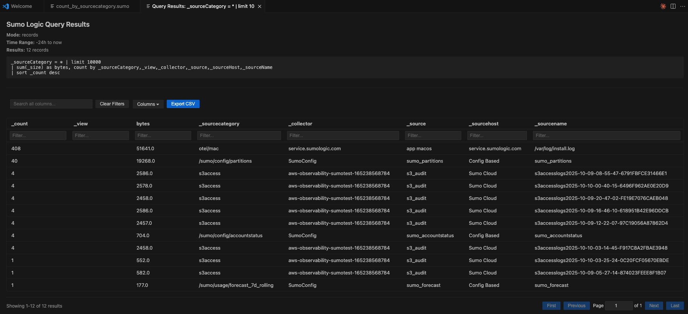
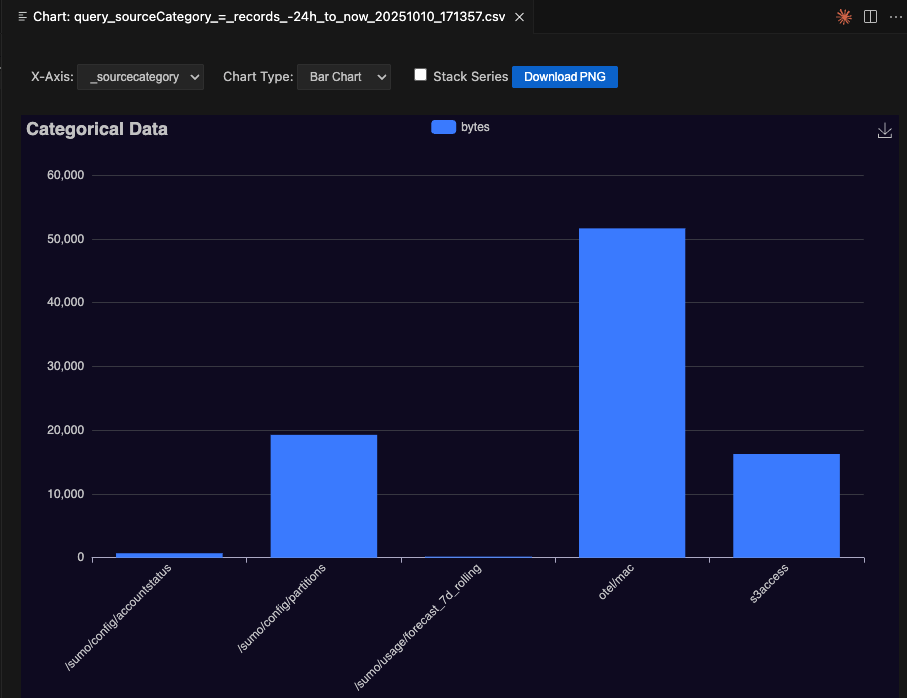
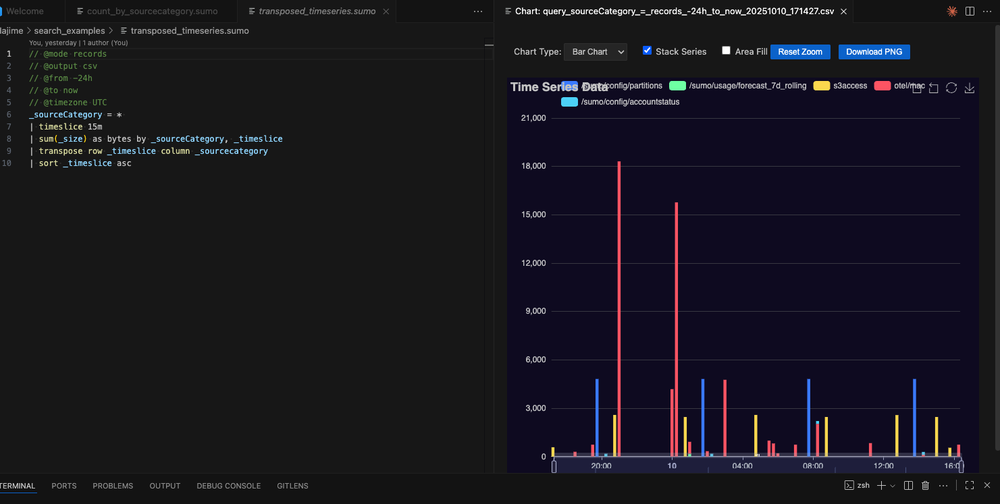

# Sumo Logic Query Language Support

Hajime Sumo Logic Query extension for visual studio code provides a rich IDE experience for working with Sumo Logic searches as .sumo files, and and explorer interface for browsing library content and accessing administrative functions. Write, execute, and visualize queries, manage multiple deployment connections, and interact with Sumo Logic APIs - all from within VS Code!

- [Sumo Logic Query Language Support](#sumo-logic-query-language-support)
  - [Overview](#overview)
    - [🎯 Tree View Sidebar for Easy Navigation](#-tree-view-sidebar-for-easy-navigation)
    - [🎯 IDE Experience for Query Development](#-ide-experience-for-query-development)
    - [🔌 Multi-Profile Connection Management](#-multi-profile-connection-management)
    - [📊 Query Execution with Multiple Output Formats](#-query-execution-with-multiple-output-formats)
    - [Interactive Webview For Query Message or Records Results](#interactive-webview-for-query-message-or-records-results)
    - [📈 Advanced Data Visualization From Webview](#-advanced-data-visualization-from-webview)
    - [🔧 API Integration \& Metadata Management Under a Profile Node](#-api-integration--metadata-management-under-a-profile-node)
    - [📚 Library Explorer - Navigate Your Content Library](#-library-explorer---navigate-your-content-library)
  - [Quick Start](#quick-start)
  - [Detailed Features](#detailed-features)
    - [Language Support](#language-support)
  - [Usage Guide](#usage-guide)
    - [Working with Scopes](#working-with-scopes)
    - [Writing Queries](#writing-queries)
    - [Executing Queries](#executing-queries)
      - [1. Standard Query Execution](#1-standard-query-execution)
      - [2. Interactive Webview Table](#2-interactive-webview-table)
      - [3. Auto-Charting](#3-auto-charting)
    - [Managing Connections](#managing-connections)
    - [Working with Saved Searches](#working-with-saved-searches)
    - [Recent Queries](#recent-queries)
    - [Fetching Metadata \& Configuration For Auto Complete](#fetching-metadata--configuration-for-auto-complete)
    - [Users \& Roles Management](#users--roles-management)
    - [Account Management](#account-management)
    - [Content Library Export](#content-library-export)
    - [Library Database Viewer](#library-database-viewer)
    - [Utility Commands](#utility-commands)
  - [Example Workflows](#example-workflows)
    - [Workflow 1: Writing and Executing a Query](#workflow-1-writing-and-executing-a-query)
    - [Workflow 1b: Parameterized Query](#workflow-1b-parameterized-query)
    - [Workflow 2: Extracting and Running a Saved Search](#workflow-2-extracting-and-running-a-saved-search)
    - [Workflow 3: Bulk Content Download](#workflow-3-bulk-content-download)
  - [Keyboard Shortcuts](#keyboard-shortcuts)
  - [Configuration](#configuration)
    - [Extension Settings](#extension-settings)
    - [Query Metadata Directives](#query-metadata-directives)
  - [Requirements](#requirements)
  - [Known Issues](#known-issues)
  - [Frequently Asked Questions](#frequently-asked-questions)
  - [Release Notes](#release-notes)
  - [Development](#development)
    - [Native Module Dependencies](#native-module-dependencies)
  - [Contributing](#contributing)
  - [License](#license)

## Overview

**Hajime** transforms VS Code into a powerful development environment for Sumo Logic, offering:

### 🎯 Tree View Sidebar for Easy Navigation
Dedicated sidebar in the activity bar provides one-click access to:

**Root Level Sections:**
- **Active Profile** - See current connection at a glance
- **Quick Actions** - Common commands (New Query, Run Query, Open Exported Content)
- **Profiles** - Expandable list of all configured profiles
- **Recent Queries** - Recently opened .sumo files with intelligent tracking across profiles
- **Recent Content** - Recently viewed library items (dashboards, searches, etc.)
- **Recent Results** - Recently executed query results for quick re-opening
- **Scopes** - Define and manage log analysis scopes for efficient data exploration
  - Create scopes with search filters (e.g., `_sourceCategory=prod/app`)
  - Profile logs fields showing field distributions
  - Sample logs to preview data within scope
  - Cache metadata for autocomplete in .sumo editor windows
  - Generate queries from scopes with field lists
  - Auto-create scopes from partitions
- **Storage Explorer** - Browse profile-specific cached files and directories

**Under Each Profile (Expandable):**
- **Test Connection** - Quick connectivity check
- **Autocomplete Data** - Manage cached autocomplete data
  - View cached fields, partitions, and metadata
  - Clear autocomplete cache
- **Collectors** - Quick access to collector management
- **Library Explorer** - Full hierarchical navigation of content library
  - Browse Personal, Global, Admin Recommended, and Installed Apps folders
  - Recursive folder fetching for bulk content downloads
  - Click items to view in specialized webviews (dashboards, searches, generic)
  - Right-click context menu with 7+ actions
  - Database Viewer for exploring library cache with user enrichment
- **Users** - View and search organization users
  - Dedicated webview with filtering, sorting, and pagination
  - User email enrichment in library content metadata
  - Export to CSV
- **Roles** - View and search organization roles
  - Dedicated webview with capabilities and user counts
  - Export to CSV
- **Dashboards** - Dashboard management and viewing
  - List dashboards from library with filtering
  - View dashboard properties and panels
- **Account** - Account information and usage reporting
  - View account owner, status, and subdomain
  - Usage forecast with configurable time periods (7, 28, 90, or custom days)
  - Generate credits usage reports with job polling and CSV export
  - All data cached to `<profile>/account/` folder

### 🎯 IDE Experience for Query Development
Rich language support for `.sumo` files with intelligent autocomplete for all log search operators and built in fields. Additional advanced auto complete experience:
- **Parser Snippets** from Sumo Logic apps (AWS, Azure, GCP, security tools, etc.) Type `parser` to trigger list
- **Dynamic Field Discovery** - fields from your query results automatically added to autocomplete
- **Context-Aware Suggestions** - metadata field values suggested as you type (e.g., `_sourceCategory=` shows your actual categories)
- **Syntax Highlighting** with full support for operators, functions, comments, and regex patterns
- **Smart Snippets** for common query patterns like timeslice / transpose
- **cache key metadata values** for _sourcecategory, _collector etc, using a query to pull recent live values
- **retreive partitions** for _index auto complete
- **pull all custom fields** for improved auto completion suggestions

### 🔌 Multi-Profile Connection Management
Connect to multiple Sumo Logic deployments and easily switch between them:
- **Secure Credential Storage** using VS Code's secret storage
- **Multiple Profiles** - Production, Development, Customer environments, etc.
- **Quick Profile Switching** from the status bar (click to switch or use `Cmd/Ctrl+K Cmd/Ctrl+S`)
- **Connection Status Indicator** - visual status in status bar (✓ connected / ✗ disconnected / ? unknown)
- **Per-Profile Data** - autocomplete suggestions, query history, and outputs organized by profile
- **API Integration** - execute queries, fetch metadata, manage collectors, explore content library

### 📊 Query Execution with Multiple Output Formats
Execute queries directly from VS Code with flexible output options:
- **CodeLens Actions** - Inline buttons (▶ Run | 📊 Webview | 📈 Chart) appear above queries
- **Query Metadata Directives** - control time range, timezone, output format, parsing mode via comments in your query
- **Automatic Mode Detection** - smart detection of aggregated vs. raw log queries
- **Context Menus** - Right-click in .sumo files or file explorer for quick actions
- **Multiple Outputs** - formatted tables, JSON, or CSV files, or option to open in a webview
- **Quick-Charting** - Quick visualization with Apache ECharts (line, bar, pie, scatter charts) from a shortcut action in .sumo file that produces a csv format file for charting visualize using apache echart





### Interactive Webview For Query Message or Records Results
Open a JSON query result file in a paginated, sortable, filterable table for exploring large result sets with:
- **Fields Breakdown** - with fields, data types and stats.
- **Performance Metrics** - execution time and job statistics displayed
- **Export Options** - export to CSV or JSON with visible columns and filters applied
- **Copy Functionality** - copy visible data to clipboard in tab-separated format
- **Column Visibility** - show/hide columns dynamically
- **Global Search** - search across all columns simultaneously

### 📈 Advanced Data Visualization From Webview
Visualize query results and data files with interactive charts using 'chart field' in the messages or records webview. The web view will open customised to the type of query whether that is records or messages mode.
- **Apache ECharts Integration** - professional, interactive charts with zoom, pan, and export
- **Category Charts** - bar and pie charts for aggregations
- **Time-Series Charts** - line and area charts for timeslice queries

### 🔧 API Integration & Metadata Management Under a Profile Node
Fetch and manage configuration from your Sumo Logic deployment:
- **Users & Roles** - fetch and cache organization users and roles with dedicated webviews
- **User Enrichment** - automatic mapping of user IDs to emails in library metadata
- **Account Management** - view account owner, status, subdomain, usage forecasts, and generate credits usage reports
- **Collectors & Sources** - list, inspect, and export collector/source configurations
- **Custom Fields** - fetch field schemas for accurate autocomplete
- **Partitions** - retrieve partition definitions for `_index` and `_view` usage
- **Metadata Caching** - cache common field values for faster autocomplete
- **Content Library API** - programmatic access to browse and export content

### 📚 Library Explorer - Navigate Your Content Library
Full hierarchical tree view of your Sumo Logic content library with intelligent caching:
- **Four Top-Level Sections** - Personal, Global, Admin Recommended, and Installed Apps
- **Lazy Loading** - Folders load children only when expanded for fast performance
- **Recursive Fetching** - Bulk download entire folder hierarchies
- **Database Viewer** - Browse library cache database with:
  - SQL query interface for exploring content
  - Pre-built queries for common operations
  - View content JSON directly from database
  - Export query results
  - **SQLite Caching** - Local database caches content metadata for instant navigation
- **Rich Context Menus** - Right-click any item for actions:
  - **View Details** - Professional webview showing all properties with enriched user emails
  - **View Content** - Open in specialized webview with formatted display
  - **Open JSON** - View full content export in editor
  - **Open in Web UI** - Launch directly to item in Sumo Logic
  - **Copy ID** - Copy hex content ID to clipboard
  - **Copy Path** - Copy full hierarchical path (e.g., `/Personal/Dashboards/MyDash`)
  - **Refresh** - Re-fetch from API to get latest changes
  - **Export to File** - Save as JSON, Markdown, or both
  - **Fetch Recursively** - Download entire folder tree (folders only)
- **Specialized Webviews** - Click items to view formatted content:
  - **Dashboard Webview** - Shows panels, queries, variables with tables (supports v1 Reports and v2 Dashboards)
  - **Search Webview** - Displays query text, parsing mode, time range with "Open in .sumo File" button
  - **Generic Webview** - Formatted JSON display for other content types
- **Visual Icons** - Different icons for folders, dashboards, searches, lookups, etc.

## Quick Start

1. **Install the Extension** - Search for "Sumo Logic Query Language" in VS Code extensions (once it's published!) For now the local instructions are:
2. 
```bash
# Package extension locally
npx @vscode/vsce package

# List files that will be included in package
npx @vscode/vsce ls

# Install extension locally for testing
code --install-extension sumo-query-language-0.1.0.vsix

# Uninstall extension
code --uninstall-extension publisher.sumo-query-language
```

2. **Open Sumo Logic Sidebar** - Click the Sumo Logic icon in the activity bar (left sidebar)
3. **Create a Profile** - Click "Create your first profile" in the sidebar or run `Sumo Logic: Create/Update Connection Profile`
4. **Create a Query** - Click "New Query" in Quick Actions or create a file with `.sumo` extension
5. **Write Your Query** - Use autocomplete (`Ctrl+Space`) to discover operators, functions, and parsers
6. **Execute** - Click the inline ▶ Run Query button above your query, use toolbar buttons, or press `Ctrl+Enter` (Windows/Linux) or `Cmd+Enter` (Mac)

## Detailed Features

### Language Support

- **Syntax Highlighting**: Full syntax highlighting for Sumo Logic query language including:
  - Keywords and operators (`and`, `or`, `not`, `in`)
  - Functions (aggregating, math, parse, search operators)
  - Metadata fields (`_raw`, `_source`, `_sourceCategory`, etc.)
  - Comments (`//` and `/* */`)
  - Strings and regex patterns

- **IntelliSense/Autocomplete**: Intelligent code completion for:
  - 100+ Sumo Logic operators and functions
  - Built-in metadata fields
  - Hundreds of parser snippets from Sumo Logic apps (filterable by app name) type 'parser' to trigger then type part of app to search.
  - Dynamic fields from query results 
  - Custom fields from API (Fetch Custom Fields action)
  - Partition names for _index and _view (Fetch Partitons action)
  - Metadata field values (context-aware)
  - Categorized suggestions (functions, fields, operators, snippets)

- **Language Configuration**:
  - Auto-closing brackets, quotes, and parentheses
  - Comment toggling support
  - Smart bracket matching

## Usage Guide

### Working with Scopes

Scopes help you organize and explore log data by defining reusable search contexts:

1. **Create a Scope**:
   - Click "Scopes" in the sidebar, then click "Create Scope" button
   - Or run `Sumo Logic: Create Scope` from command palette
   - Provide:
     - **Name** - e.g., "Production App Logs"
     - **Search Scope** - filter query like `_sourceCategory=prod/application`
     - **Description** - optional context about the scope
     - **Context** - optional use case information
     - **Profiles** - `*` for all profiles, or comma-separated profile names

2. **Use Scope Actions**:
   - **Profile Scope (Facets)** - Analyze field distributions with top values
   - **Sample Logs** - Preview up to 1000 log messages
   - **Cache Metadata** - Add field values to autocomplete
   - **New Query** - Generate a .sumo file with scope filter and field list

3. **Auto-Create from Partitions**:
   - Click "Add Partition Scopes" to create a scope for each partition
   - Scopes include routing expressions and partition metadata
   - Use "Refresh Partition Scopes" to update existing partition scopes

4. **View Scope Results**:
   - Click a scope to open its webview
   - View properties, action results, and cached data
   - Results stored per scope with timestamps
   - Click "View" buttons to open results in interactive tables

### Writing Queries

1. **Create a Query File**:
   - Create a file with `.sumo` extension, or
   - Run `Sumo Logic: New Query File` for a template with metadata directives

2. **Use Autocomplete**:
   - Press `Ctrl+Space` (Windows/Linux) or `Cmd+Space` (macOS) to trigger suggestions
   - Type `parser` to see 4500+ parser snippets from Sumo Logic apps
   - Filter by app name (e.g., `AWS`, `Azure`, `Apache`, etc.)
   - After `=` in metadata fields, see cached values from your environment

3. **Add Query Metadata** (optional):
   ```sumo
   // @name My Query Name
   // @from -7d
   // @to now
   // @timezone UTC
   // @mode records
   // @output table
   // @byReceiptTime false
   // @autoParsingMode Manual

   _sourceCategory=prod/application error
   | count by _sourceHost
   ```

4. **Use Query Parameters** (optional):
   Add parameterized queries with `{{paramName}}` placeholders that can be set via metadata directives or prompted at runtime:
   ```sumo
   // @from -7d
   // @to now
   // @param type=copilot
   // @param user_name=*

   _sourceCategory=prod
   | where query_type="{{type}}"
   | where user_name="{{user_name}}"
   | count by user_name
   ```

   When you run this query:
   - Parameters with `@param` directives use those default values
   - Parameters without directives prompt you for a value (default: `*`)
   - All `{{paramName}}` placeholders are substituted before execution

### Executing Queries

There are three ways to execute queries, each with different visualization options:

#### 1. Standard Query Execution
**Command**: `Sumo Logic: Run Query` (toolbar ▶️ button)

Outputs results in your choice of format:
- **Table** - Formatted text table (default)
- **JSON** - Raw JSON response
- **CSV** - Comma-separated values (aggregated queries only)

Specify format using `// @output table|json|csv` directive in your query.

#### 2. Interactive Webview Table
**Command**: `Sumo Logic: Run Query in Webview` (toolbar 📋 button or `Ctrl/Cmd+Shift+Enter`)

Displays results in an interactive table with:
- **Pagination** - configurable page size with page navigation
- **Sorting** - click column headers to sort ascending/descending
- **Filtering** - search across all columns with per-column filters
- **Column Management** - show/hide columns, resize columns
- **Performance Metrics** - view execution time and job statistics
- **Export** - export to CSV or JSON with visible columns only
- **Copy** - copy visible data to clipboard in tab-separated format

Perfect for exploring large result sets (thousands of rows).

#### 3. Auto-Charting
**Command**: `Sumo Logic: Run Query and Chart Results` (toolbar 📈 button)

Automatically generates interactive charts from your query results:
- **Time-Series** - Line/area charts for timeslice queries
- **Category Data** - Bar/pie charts for aggregations
- **Interactive** - Zoom, pan, export via Apache ECharts

Also works on CSV files: Right-click any `.csv` file → `Sumo Logic: Chart CSV Data`

### Managing Connections

**Connection profiles** let you work with multiple Sumo Logic deployments:

1. **Create a Profile**:
   - Click the Sumo Logic icon in the activity bar to open the sidebar
   - Click the + button in the view header, or click "Create your first profile"
   - Or run `Sumo Logic: Create/Update Connection Profile` from command palette
   - Enter profile name (e.g., `Production`, `Dev`, `Customer-ABC`)
   - Select region (us1, us2, eu, au, de, jp, ca, in) or enter custom endpoint
   - Enter Access ID and Access Key (stored securely)

2. **Switch Profiles**:
   - Click any profile in the sidebar's Profiles section, or
   - Click the profile name in the status bar (bottom-right), or
   - Run `Sumo Logic: Switch Profile` from command palette
   - All queries and API calls use the active profile

3. **Manage Profiles**:
   - Right-click a profile in the sidebar for quick actions (Switch, Delete, Test Connection)
   - Or use command palette: `List Profiles`, `Test Connection`, `Delete Profile`

**Profile Features**:
- 🔐 Credentials stored securely in VS Code's secret storage
- 💾 Per-profile autocomplete data (fields, partitions, metadata values)
- 📁 Organized output: `output/<profile>/queries/`, `collectors/`, `searches/`, etc.
- 🔄 Quick switching without re-entering credentials
- 👁️ Visual indicator showing active profile in sidebar

### Working with Saved Searches

Library searches can be exported to .sumo files for editing and execution:

1. **Browse to a Search** in the Library Explorer
2. **Click to View** - Opens specialized search webview showing:
   - Query text with syntax
   - By receipt time setting
   - Parsing mode
   - Default time range
3. **Click "Open in .sumo File"** button
4. **File is Created** in `output/<profile>/searches/` with:
   - Sanitized filename: `{search_name}_{content_id}.sumo`
   - Query metadata directives from search properties
   - Full query text ready to run
5. **File Added to Recent Queries** - Appears in sidebar for quick access
6. **Execute with Run Query** - Use all standard query execution features

### Recent Queries

The extension automatically tracks .sumo files you open:

- **Automatic Tracking** - Any .sumo file you open is added to recent queries
- **Profile-Aware** - Tracks which profile was active when file was opened
- **Intelligent Display** - Shows query name (from `@name` directive) or filename
- **Rich Tooltips** - Hover to see:
  - Full file path
  - Last opened timestamp
  - Associated profile
  - Query preview (first non-comment line)
- **Persistent** - Recent queries saved across VS Code sessions
- **Quick Access** - Click any recent query in sidebar to reopen it

### Fetching Metadata & Configuration For Auto Complete

Enhance autocomplete and export configuration from your Sumo Logic deployment:

| Command | What It Does | Output Location |
|---------|--------------|-----------------|
| **Fetch Custom Fields for Autocomplete** | Retrieves custom field definitions from your org | Adds to autocomplete + `output/<profile>/customfields/` |
| **Fetch Partitions for Autocomplete** | Retrieves partition list and routing expressions | Adds to autocomplete + `output/<profile>/partitions/` |
| **Fetch Users** | Retrieves all users in your organization | Cached in `<profile>/metadata/users_roles.db` |
| **Fetch Roles** | Retrieves all roles and their capabilities | Cached in `<profile>/metadata/users_roles.db` |
| **Fetch Collectors** | Lists all collectors with health stats (alive/dead, by type) | `output/<profile>/collectors/` (table format) |
| **Get Collector by ID** | Gets detailed configuration for a specific collector | `output/<profile>/collectors/` (JSON) |
| **Get Sources for Collector** | Lists all sources for a collector with health info | `output/<profile>/collectors/` (JSON) |
| **Cache Key Metadata** | Analyzes query results to cache common field values | Adds to autocomplete cache |
| **Get Personal Folder** | Shows your personal folder contents | Opens in new tab |
| **Get Folder by ID** | Shows any folder's contents and properties | Opens in new tab |

All fetched data enhances autocomplete and is persisted per profile.

### Users & Roles Management

View and manage users and roles in your Sumo Logic organization:

1. **Fetch Users and Roles**:
   - Run `Sumo Logic: Fetch Users` to cache all users
   - Run `Sumo Logic: Fetch Roles` to cache all roles
   - Or use `Sumo Logic: Fetch Users and Roles` to fetch both
   - Data stored in SQLite database per profile

2. **Browse Users**:
   - Expand a profile in the sidebar → click "Users"
   - Opens interactive webview with all users
   - Filter by ID, name, email, or status
   - Sort by any column
   - See user roles, MFA status, and lock status
   - Export to CSV

3. **Browse Roles**:
   - Expand a profile in the sidebar → click "Roles"
   - Opens interactive webview with all roles
   - Filter by ID, name, or description
   - View capabilities and user count
   - Sort by any column
   - Export to CSV

4. **User Enrichment**:
   - Database Viewer shows user emails instead of IDs in "Created By" column
   - Library Content Details shows enriched creator/modifier information
   - All library views automatically enrich user IDs with emails when available

### Account Management

View account information and generate usage reports:

1. **Open Account Management**:
   - Expand a profile in the sidebar → click "Account"
   - Opens interactive webview with account management features

2. **View Account Information**:
   - **Account Owner** - View organization owner details
   - **Account Status** - Check account capabilities and settings
   - **Subdomain** - View organization subdomain and URL
   - All data fetched from API and cached to `<profile>/account/` folder

3. **Usage Forecast**:
   - Select time period: 7, 28, 90, or custom days
   - Click "Fetch Usage Forecast" to retrieve forecast data
   - View daily usage predictions
   - Data cached as JSON for reference

4. **Generate Credits Usage Report**:
   - Configure report parameters:
     - **Group By**: day, week, or month
     - **Report Type**: standard, detailed, or child detailed
     - **Include Deployment Charge**: optional checkbox
   - Click "Generate Report" to start export job
   - Extension polls job status automatically
   - When complete, prompted to save CSV file
   - Default location: `<profile>/usage/usage_<timestamp>.csv`
   - File opens automatically after download

### Content Library Export

Export content items and special folders from the Sumo Logic Content Library as JSON with markdown summaries.

**Access from Sidebar**:
Open the Sumo Logic sidebar → expand the **Library** section or **Content** section to see export options.

Or use command palette commands:

| Command | What It Does | Output |
|---------|--------------|--------|
| **Get Content by Path** | Fetch content item using its full path | Summary or JSON format |
| **Get Content by ID** | Fetch content item by ID (also shows path) | Summary or JSON format |
| **Export Content** | Export any content item (folder, dashboard, search, etc.) with full definition including children | JSON + Markdown summary |
| **Export Admin Recommended Folder** | Export the Admin Recommended system folder | JSON + Markdown summary (overwrites) |
| **Export Global Folder** | Export the Global system folder | JSON + Markdown summary (overwrites) |
| **Export Installed Apps Folder** | Export the Installed Apps system folder | JSON + Markdown summary (overwrites) |
| **Fetch Folder Recursively** | Download entire folder hierarchy with all children | Bulk cached to database |

**Export Features**:
- 📦 **Two file formats**: Full JSON export + human-readable markdown summary
- 🔗 **Linked files**: Markdown summary includes a link to the JSON file
- 📊 **Formatted tables**: Children, panels, and other arrays displayed as tables in markdown
- 🔄 **Async job polling**: Automatically waits for export jobs to complete
- 🆔 **ID tracking**: All items include their Sumo Logic content ID for reference
- 📁 **Organization**: Files saved to `output/<profile>/content/`
- 🗂️ **Recursive fetching**: Download entire folder trees for offline access

**File Naming**:
- Regular content exports: Timestamped files (e.g., `export_content_12345_Dashboard_20250113_143025.json`)
- System folder exports: Single overwriting file (e.g., `export_admin_recommended_Admin_Recommended.json`)
- Search exports: Sanitized names in `searches/` folder

### Library Database Viewer

Explore the SQLite cache database that stores library metadata:

1. **Open Database Viewer**:
   - Right-click profile in sidebar → "Open Database Viewer"
   - Or run `Sumo Logic: Open Database Viewer` from command palette

2. **Features**:
   - Browse cached content items with filtering and pagination
   - Run custom SQL queries against the database
   - Pre-built queries for common operations (dashboards, searches, folders, etc.)
   - View item details and full JSON
   - Export query results to CSV
   - Refresh database to get latest cache

3. **Use Cases**:
   - Find all dashboards modified in last 7 days
   - List searches by specific author
   - Audit content permissions
   - Analyze content structure
   - Debug caching issues

### Utility Commands

| Command | Description |
|---------|-------------|
| **New Query File** | Create a `.sumo` file with template and metadata directives |
| **Cleanup Old Files** | Remove old query results (by age) to manage disk space |
| **View Autocomplete Data** | Inspect what's cached for autocomplete in active profile |
| **Clear Autocomplete Data** | Clear all autocomplete cache for active profile |
| **Open Database Viewer** | Browse library cache database for active profile |

## Example Workflows

### Workflow 1: Writing and Executing a Query

```sumo
// Query metadata (optional)
// @name Error Analysis
// @from -24h
// @to now
// @output table
// @byReceiptTime false
// @autoParsingMode Manual

// Search for errors in production
_sourceCategory=prod/application error
| parse regex field=_raw "(?<error_type>\w+Error)"
| count by error_type
| sort _count desc
```

1. Use autocomplete to discover operators and fields
2. Click ▶️ to execute with table output
3. Fields like `error_type` automatically added to autocomplete
4. Try 📋 button for interactive table or 📈 for charts

### Workflow 1b: Parameterized Query

```sumo
// @name User Activity by Type
// @from -7d
// @to now
// @param type=copilot
// @param user_name=*
// @output webview

_sourceCategory=prod
| where query_type="{{type}}"
| where user_name="{{user_name}}"
| timeslice 1h
| count by _timeslice, user_name
| transpose row _timeslice column user_name
```

1. Parameters with `@param` directives use default values automatically
2. Parameters without `@param` prompt for values when query runs
3. Click ▶️ to execute - parameters are substituted before running
4. Modify `@param` values and re-run to test different scenarios

### Workflow 2: Extracting and Running a Saved Search

1. Open Library Explorer in sidebar
2. Navigate to `/Personal/Monitoring/Alert Queries`
3. Click on a search to view in specialized webview
4. Review query details, parsing mode, time range
5. Click "Open in .sumo File" button
6. File opens with all metadata directives pre-filled
7. File appears in Recent Queries for easy access
8. Execute with standard Run Query commands
9. Modify query and save your customized version

### Workflow 3: Bulk Content Download

1. Right-click a folder in Library Explorer
2. Select "Fetch Folder Recursively"
3. Extension downloads entire folder tree
4. Progress shown in status bar
5. All content cached locally in SQLite database
6. Browse downloaded content offline
7. Use Database Viewer to query and analyze content

## Keyboard Shortcuts

The extension provides convenient keyboard shortcuts for common operations:

| Command | Windows/Linux | macOS | Description |
|---------|---------------|-------|-------------|
| **Run Query** | `Ctrl+Enter` | `Cmd+Enter` | Execute the current query with standard output |
| **Run Query in Webview** | `Ctrl+Shift+Enter` | `Cmd+Shift+Enter` | Execute query with interactive table view |
| **Run Query and Chart** | `Ctrl+Shift+C` | `Cmd+Shift+C` | Execute query and auto-generate chart |
| **New Query File** | `Ctrl+Shift+N` | `Cmd+Shift+N` | Create a new .sumo query file |
| **Switch Profile** | `Ctrl+K Ctrl+S` | `Cmd+K Cmd+S` | Switch between connection profiles |

All keyboard shortcuts work when editing `.sumo` files (except Switch Profile which is global).

## Configuration

### Extension Settings

| Setting | Default | Description |
|---------|---------|-------------|
| `sumologic.fileStoragePath` | `${workspaceFolder}/output` | Directory for output files. Supports `${workspaceFolder}` variable.  |
| `sumologic.webviewPageSize` | `100` | Number of rows per page in webview tables (10-10000) |

The extension activates automatically when you open `.sumo` files.

### Query Metadata Directives

Control query execution with comment directives:

```sumo
// @name My Query             // Query name for saved queries
// @from -7d                   // Start time (relative: -1h, -7d or absolute: 2024-01-01T00:00:00)
// @to now                     // End time (relative or absolute)
// @timezone UTC               // Timezone for query execution
// @mode records               // Result type: records (aggregated) or messages (raw logs)
// @output table               // Output format: table, json, csv, or webview
// @byReceiptTime false        // Run by receipt time (true/false)
// @autoParsingMode Manual     // Auto-parsing: AutoParse or Manual
// @debug true                 // Enable debug output showing detailed API information and job status
// @param paramName=value      // Set default value for {{paramName}} placeholder
```

**Parameter Substitution**:
Use `{{paramName}}` placeholders in your query and control their values with `@param` directives:

```sumo
// @from -7d
// @to now
// @param type=copilot
// @param user_name=*

_sourceCategory=prod
| where query_type="{{type}}"
| where user_name="{{user_name}}"
| count by user_name
```

- Parameters with `@param` directives use the specified default value
- Parameters without `@param` directives prompt for a value at runtime (default: `*`)
- All `{{paramName}}` placeholders are replaced before query execution

## Requirements

- Visual Studio Code 1.74.0 or higher
- Sumo Logic Access ID and Access Key (for API integration)
- Appropriate permissions in Sumo Logic:
  - Query execution: Basic user
  - Custom fields: "Manage fields" capability
  - Partitions: "View Partitions" capability
  - Collectors: "Manage or View Collectors" capability
  - Content Library: "View Content" capability

## Known Issues

None at this time. Please report issues on the [GitHub repository](https://github.com/yourusername/hajime).

## Frequently Asked Questions

**Q: Where are my credentials stored?**
A: Credentials are stored securely in VS Code's Secret Storage API, not in plain text files.

**Q: Can I use custom endpoints (not standard regions)?**
A: Yes, when creating a profile, you can enter a custom endpoint URL instead of selecting a region.

**Q: How do I see my recent queries?**
A: The Recent Queries section in the sidebar shows all .sumo files you've opened recently, with profile tracking and query previews.

**Q: Can I share profiles across workspaces?**
A: Profiles are stored globally in VS Code, so they're available in all workspaces. However, autocomplete data and output files are workspace-specific.

**Q: What if I have more than 1000 collectors/sources?**
A: The extension automatically handles pagination, fetching all items regardless of count.

**Q: How do I view dashboards and searches in a formatted way?**
A: Click on dashboard or search items in the Library Explorer to open specialized webviews with formatted displays.

## Release Notes

See [CHANGELOG.md](CHANGELOG.md) for detailed release history.

## Development

For extension development:

1. Clone the repository
2. Run `npm install` to install dependencies (includes automatic native module rebuild for Electron)
3. Press `F5` to open a new VS Code window with the extension loaded
4. Create or open a `.sumo` file to test

### Native Module Dependencies

This extension uses `better-sqlite3`, a native Node.js module that must be compiled for Electron's specific Node.js version.

**The `postinstall` script automatically handles this**, but if you encounter `NODE_MODULE_VERSION mismatch` errors, manually rebuild with:
```bash
npm run rebuild
```

**Why this is needed:**
- VSCode uses Electron with a specific NODE_MODULE_VERSION
- Native modules must match Electron's version to work in VSCode extensions

For more information:
- [VS Code Extension API](https://code.visualstudio.com/api/get-started/your-first-extension)
- [VS Code Extension Samples](https://github.com/microsoft/vscode-extension-samples)

## Contributing

Contributions are welcome! Please feel free to submit issues and pull requests.

## License

MIT
